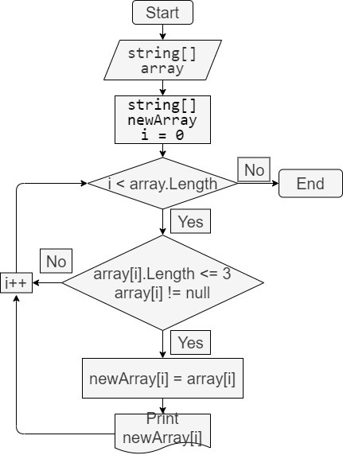

## Задача
>Написать программу, которая из имеющегося массива строк формирует новый массив из строк, длина которых меньше либо равна 3 символа. Первоначальный массив можно ввести с клавиатуры, либо задать на старте выполнения алгоритма. При решении не рекомендуется пользоваться коллекциями, лучше обойтись исключительно массивами.

## Описание решения

>1. Просим пользователя ввести массив данных типа string.
>2. Считываем их с консоли и заполняем ими массив.
>3. Разбиваем данные массива разделителем - ",".
>4. Создаём новый массив для вывода.
>5. Используем цикл for.
>6. Внутри цикла проверяем условия, при которых длина строк должна быть меньше, либо равна 3-м символам, и элемент строки не должен иметь пустое значение. Используя оператор '!', исключаем значение null.
>7. Если условие выполняется, присваиваем значение текущего индекса заданного массива индексу нового массива, и выводим его на консоль.

Код проекта в файле Program.cs. 

## Блок-схема алгоритма
